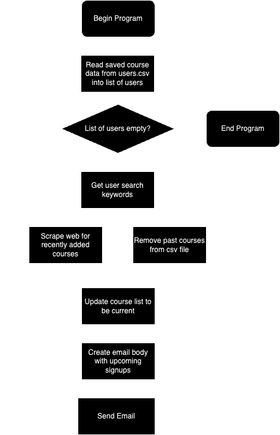

# Mountaineers-Trip-Notifications
<h1>Purpose:</h1>
The purpose of this project is to create a system that can notify users of trips that have been added to the Mountaineers 
website, as well as remind users of upcoming enrollment dates to make it easier to keep track of trips the user is 
interested in joining.

<h1>Technologies used:</h1>
<h1>Usage Instructions:</h1>
<h1>Program Road Map:</h1>

<h1>Project Status:</h1>
Started January 2024. Currently in progress